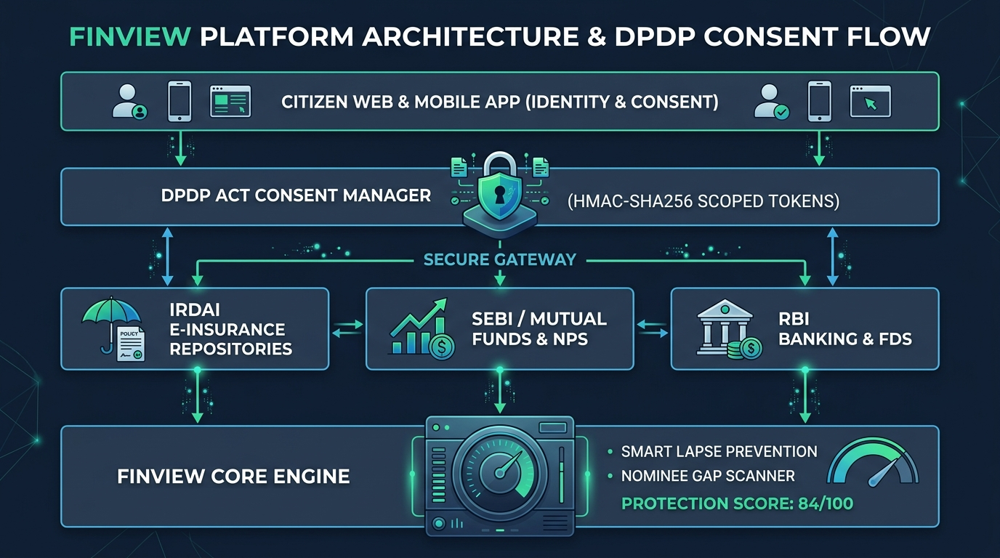
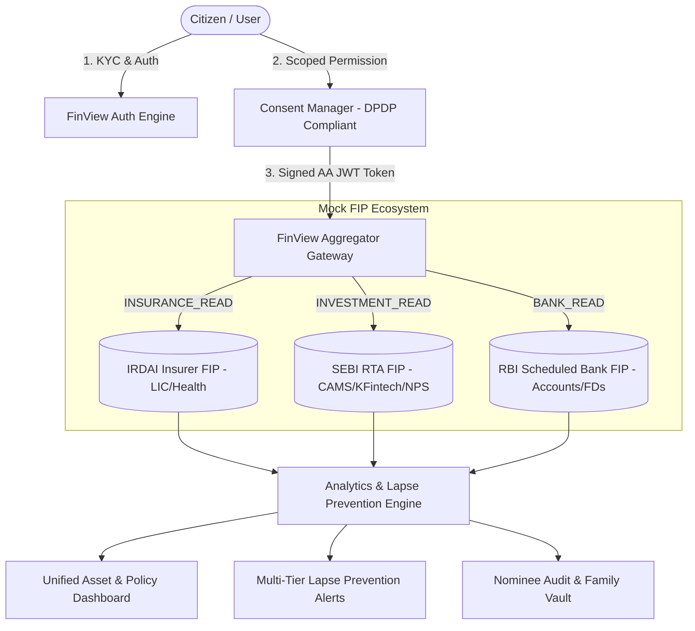
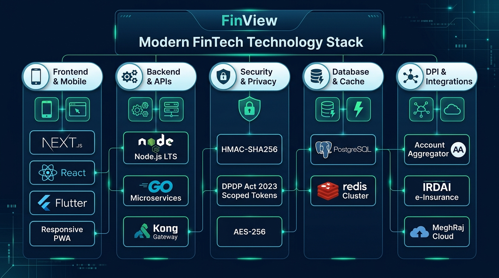

# 🛡️ FinView — Unified Financial Asset & Insurance Management Platform

[](https://sih.gov.in)
[](#privacy--dpdp-act-compliance)
[](#system-architecture)
[](LICENSE)
[](#-deployment)

> **FinView** is a privacy-first, consent-governed monitoring and intelligence platform built on India's **Digital Public Infrastructure (DPI)**. It bridges the gap between **IRDAI e-Insurance Accounts (eIA)**, the **Account Aggregator (AA) ecosystem**, and citizens to eliminate forgotten investments, prevent policy lapses, and audit family nominee coverage.

---

## 📌 Problem Statement & Context

Millions of Indian citizens hold financial assets and insurance policies distributed across disparate insurers, mutual fund houses, pension providers (NPS), and scheduled banks. 

* **The Problem:** Lack of a single, unified view leads to missed premium deadlines, accidental policy lapses, and massive unclaimed financial assets (**₹35,000+ Crore** in the Indian financial ecosystem).
* **The FinView Solution:** A unified monitoring layer providing **real-time policy visibility**, **multi-tier lapse prevention alerts**, **nominee gap audits**, and **instant, revocable DPDP consent governance**.

---

## ✨ Key Features

### 1. 🛡️ Unified Insurance & Asset Repository
* Aggregates Life, Health, and Motor insurance policies alongside Mutual Funds, NPS Tier-1 holdings, and Bank Fixed Deposits into a single pane of glass.
* Tracks active policy status, sum assured, next premium due dates, and fund valuations.

### 2. 🚨 Smart Lapse Prevention Engine
* **Predictive Countdown Alerts:** Multi-tier alert hierarchy at 30-day, 15-day, 7-day, and 3-day intervals.
* **Grace Period Safeguard:** Identifies policies within the critical 30-day grace period to prevent loss of accumulated bonuses and termination of coverage.
* **Multi-Channel Dispatch Simulation:** Automated WhatsApp Business and SMS notification templates.

### 3. 👨‍👩‍👧 Family & Nominee Governance Vault
* **Nominee Gap Audit:** Automated scanning to flag policies or folios missing registered nominees, reducing the risk of estate disputes and unclaimed assets.
* **Emergency Contact Access:** Authorizes designated family members to view essential policy numbers and claim helplines with verified documentation.

### 4. 🔒 DPDP Act 2023 Consent Control Hub
* **Granular Scoped Access:** Users independently authorize `INSURANCE_READ`, `INVESTMENT_READ`, and `BANK_READ`.
* **Purpose & Retention Limits:** Strict purpose binding (`PERSONAL_FINANCE_DASHBOARD`) and user-defined data validity timelines.
* **Instant 1-Click Revocation:** Users can withdraw consent at any time, immediately invalidating cryptographic access tokens across all FIPs.

### 5. 🔍 Live Judge API & Architecture Inspector
* Embedded slide-over developer drawer displaying live HMAC-SHA256 JWT claims, raw FIP JSON payloads, and reproducible cURL commands.

---

## 🏛️ System Architecture

<p align="center">
  
</p>



---

## 🔒 Privacy & DPDP Act Compliance

FinView adheres to the core tenets of the **Digital Personal Data Protection (DPDP) Act 2023**:

1. **Lawful & Informed Consent:** Explicit affirmative action with transparent scope declarations before data access.
2. **Purpose Limitation:** Data retrieved is strictly utilized for authorized financial monitoring.
3. **Data Minimization & Time Bounding:** Access tokens automatically expire according to the user-selected data retention duration.
4. **Unconditional Right of Withdrawal:** Consent revocation is supported with immediate token invalidation across all connected endpoints.
5. **Zero Data Commercialization:** Personal financial records are never sold, rented, or shared with advertisers.

---

## 🛠️ Tech Stack & Specifications

<p align="center">
  
</p>

* **Backend:** Node.js HTTP Server (Pure standard library implementation — zero runtime dependency footprint)
* **Frontend:** Responsive Single-Page Application (SPA) utilizing modern Fintech UI, Tailwind-compatible styling, Lucide icons, and Chart.js.
* **Authentication & Security:** RFC 7519 HMAC-SHA256 JWT tokens with standardized Account Aggregator metadata.
* **Architecture:** Microservice-ready FIP endpoints (`/insurer/*`, `/investment/*`, `/bank/*`, `/consent/*`).

---

## 🚀 Quickstart Guide

### Prerequisites
* [Node.js](https://nodejs.org) (v16.x or higher)

### Local Setup
```bash
# 1. Clone the repository
git clone https://github.com/YOUR_USERNAME/finview-sih2026.git
cd finview-sih2026

# 2. Start the application server (No npm install required)
node server.js

# 3. Open the dashboard in your browser
# Visit http://localhost:5000
```

---

## ☁️ Deployment

### Deploying to Vercel
FinView includes native [`vercel.json`](vercel.json) configuration for instant zero-configuration deployment:

1. Push this repository to **GitHub**.
2. Connect your repository on **[Vercel Dashboard](https://vercel.com)**.
3. Click **Deploy**. Vercel will automatically configure serverless API endpoints and static assets.

---

## 📄 License
This project is licensed under the MIT License.
